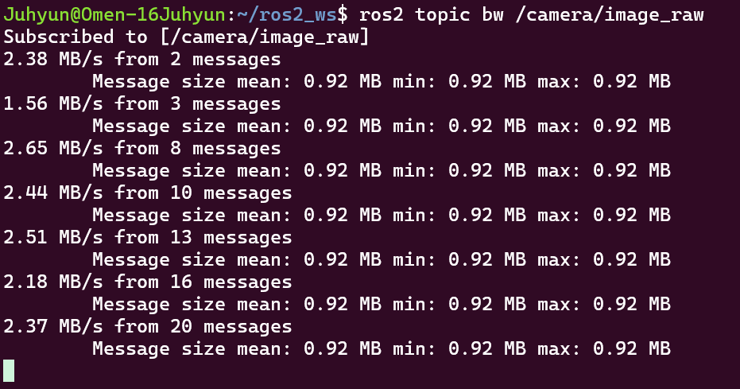
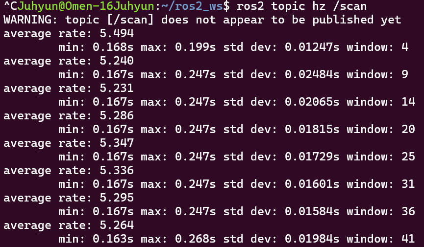
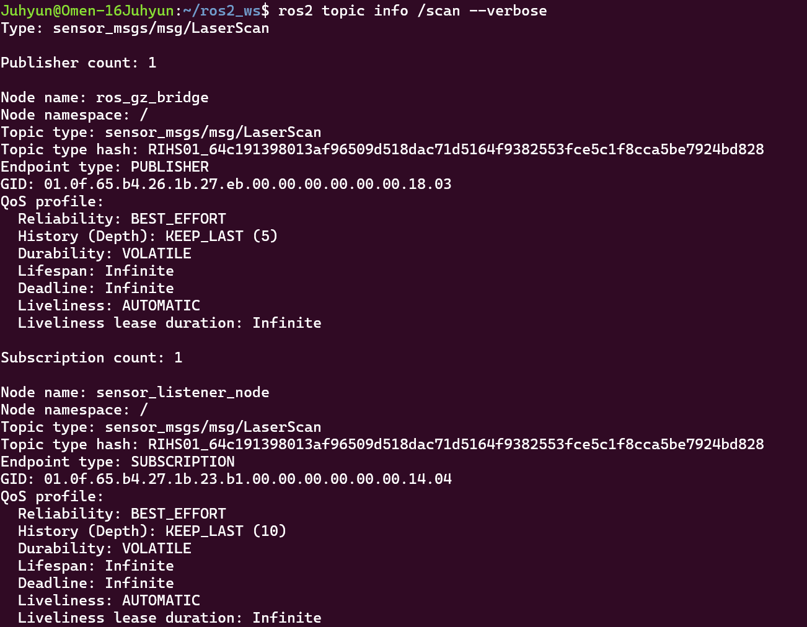

# AutomotiveSW_Juhyun

## 프로젝트 설명

ROS 2와 Gazebo Sim을 이용한 차량 센서 시뮬레이션 프로젝트입니다. `my_sensor_pkg`에서 LiDAR, 카메라, IMU 데이터를 수신하고, 방향키로 차량을 이동시킬 수 있도록 구성했습니다.

## 실행 방법

ROS 2 환경을 불러온 Ubuntu 터미널에서 실행합니다.

```bash
source /opt/ros/lyrical/setup.bash
cd ~/ros2_ws
colcon build --packages-select my_sensor_pkg --symlink-install
source install/setup.bash
ros2 launch my_sensor_pkg spawn_car.launch.py
```

다른 터미널에서 차량 제어 노드를 실행합니다.

```bash
source /opt/ros/lyrical/setup.bash
cd ~/ros2_ws
source install/setup.bash
ros2 run my_sensor_pkg keyboard_teleop
```

- ↑ / ↓: 전진 / 후진
- ← / →: 주행 중 좌우 조향
- Space: 정지
- Q: 제어 노드 종료

방향키 입력은 제어 노드를 실행한 터미널에서 받습니다. 입력이 0.6초 동안 없으면 자동으로 정지합니다.

## 실행 화면 캡처

### 카메라 데이터 전송량

`ros2 topic bw /camera/image_raw`로 카메라 데이터 수신을 확인했습니다. 캡처에서 메시지 크기는 약 0.92 MB이며, 전송량은 약 1.56~2.65 MB/s로 측정되었습니다.



### LiDAR 발행 주기

`ros2 topic hz /scan`으로 LiDAR 데이터 수신 주기를 확인했습니다. 캡처의 평균 수신 주파수는 약 5.2~5.5 Hz입니다.



### LiDAR 토픽 및 QoS

`ros2 topic info /scan --verbose`로 `sensor_msgs/msg/LaserScan` 타입과 발행자·구독자를 확인했습니다. `ros_gz_bridge`와 `sensor_listener_node`는 모두 BEST_EFFORT, VOLATILE 설정을 사용하며, 큐 깊이는 각각 5와 10입니다.



## AI 사용 내용

AI를 활용하여 기존 `my_vehicle_gazebo` 폴더의 차량 모델, 트랙, 실행 파일과 TF 데모 기능을 `my_sensor_pkg`에 복사하고, 패키지 경로 및 실행 설정을 연결했습니다. 기존 폴더는 유지하고 센서 패키지에서도 차량 기능을 사용할 수 있도록 구성했습니다.

## 본인의 보강 내용

기존 센서 데이터 수신 기능에 차량 이동 기능을 보강했습니다. 차량 구동 및 조향 설정을 추가하고, 방향키로 전진·후진과 주행 중 좌우 조향을 할 수 있도록 했습니다. Space 정지 기능과 입력이 없을 때 자동 정지하는 기능도 추가했습니다.
